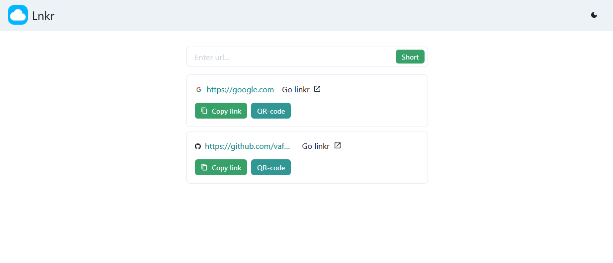

#  Shorty
 
Simple link shortening on Vue.js 

[shrt.xyz](https://shrt.xyz/)

# Used

+ [Vue.js](https://github.com/vuejs/vue)
+ [Vuetify](https://github.com/vuetifyjs/vuetify)
+ [Axios](https://github.com/axios/axios)
+ [VueQrcode](https://github.com/fengyuanchen/vue-qrcode)

# Local launch

1. Clone repo: `https://github.com/enotcode/shorty.git`
2. Run `cd shorty`
3. Run `yarn install`
4. Run `yarn serve` for live-preview
5. Go to `localhost:8080`

# License

[MIT](LICENSE)
